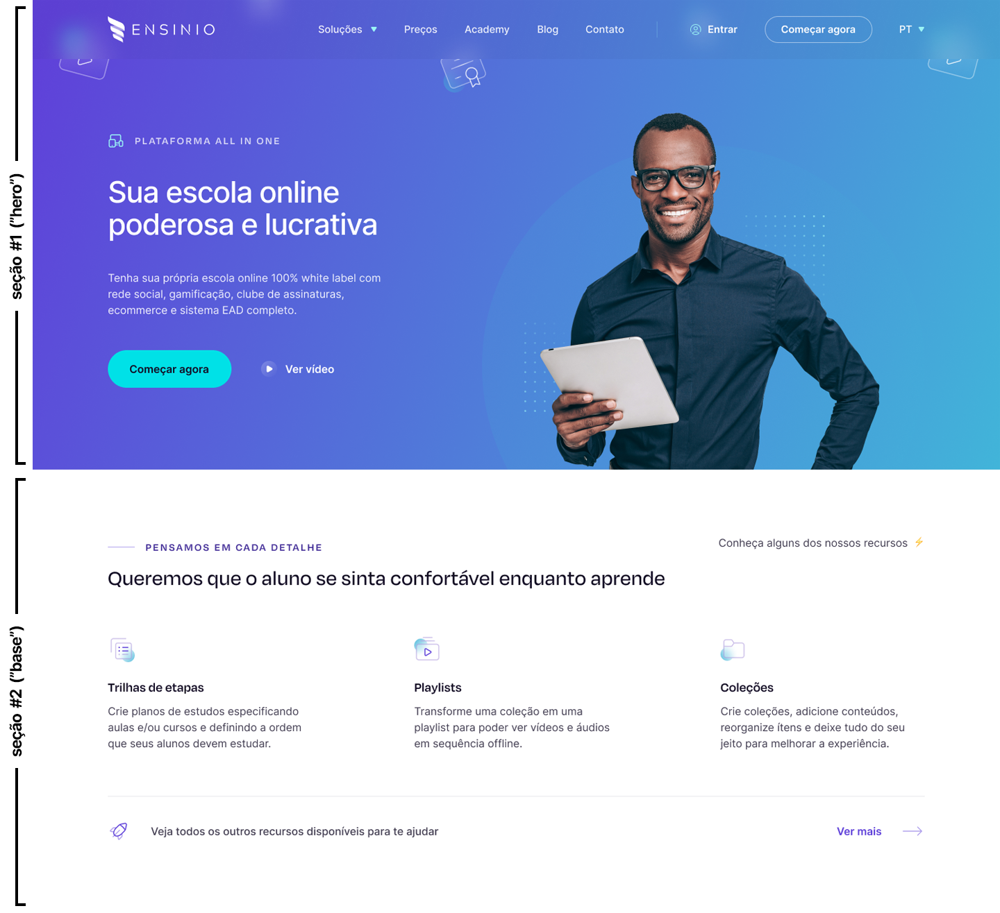

## :rocket: Teste técnico para UI Designer na Ensinio

O presente teste foi planejado para validar os conhecimentos necessários para a posição de UI Designer na Ensinio.

Serão avaliados aspectos relacionados aos conhecimentos em técnicas de concepção e prototipação de interfaces, tendências, domínio da ferramenta Figma, teoria das cores, hierarquia visual/de informações, heurísticas de usabilidade e conhecimentos congêneres.

É esperado que você resolva os problemas propostos de forma eficiente e criativa, e demonstre sua atenção a detalhes, ao passo em que entrega interfaces de alto nível, à altura da sua capacidade técnica.

Esperamos também que você se divirta e, quem sabe, aprenda algo no processo. :blush:

## :eyes: O problema

Uma interface incompleta, e um time em busca da excelência.

- https://www.figma.com/file/M0jy5rqNumytQKuKZYhgPS/Ensinio-Frontend-Challenge

## :bulb: A proposta

Você foi encarregado(a) de dar continuidade à prototipação de um website institucional, cuja identidade visual já fora estabelecida.

Duplique no figma o projeto fornecido, e trabalhe a partir da sua cópia. :smiley:

Para que possamos, entre outros aspectos, validar sua capacidade de manter um "style guide", pedimos que acrescente 2 novas seções (ou "dobras") ao site. Entenda seção como o seguinte:

Esperamos que as próximas 2 seções sigam o mesmo conceito visual das seções originalmente propostas. Não forneceremos especificações de conteúdos para as próximas seções, no entanto, você pode basear-se nas **informações** contidas em nosso [site atual](https://ensinio.com/pt-br/).

Observe também que o projeto que fornecemos contém 2 componentes de menus do tipo popover. Por gentileza, faça os respectivos itens da topbar abrirem eles (parte funcional do protótipo).

Após isso, crie - em um novo frame, ao lado - uma versão escura para a interface (dark mode), compreendendo as 4 seções (as 2 que fornecemos, mais as 2 que você criou, além dos componentes de popover).

Por fim, em novo frame - ao lado dos anteriores -, faça um redesign das 2 primeiras seções (que fornecemos originalmente), com um conceito/estilo completamente diferente, a seu critério.

Ah, e mantenha o seu projeto do figma organizado, com os elementos nomeados de modo a permitir a identificação, e componentes devidamente agrupados.

## :clap: Diferenciais

- Versões mobile;
- Mais seções :)

## :page_facing_up: Critérios de avaliação

- O cumprimento dos requisitos propostos;
- A qualidade das interfaces apresentadas (cada pixel será analisado);
- A fidelidade ao "style guide" (para o caso das 2 novas seções que devem seguir a identidade originalmente proposta);
- A organização do seu projeto: esperamos ver componentização coesa, reuso, elementos nomeados de modo a permitir a identificação, etc;
- Seu **empenho** e **carinho**! :blush:

## :lock: Autoria

As interfaces prototipadas durante o teste em questão **não serão utilizadas** para quaisquer outros fins além da avaliação do candidato. 

## :email: Sobre a entrega

Pedimos que, por gentileza, entregue o teste em até 7 dias a partir do recebimento das instruções, respondendo à **mesma conversa de email onde enviamos o link do desafio** e incluindo o link do seu projeto no figma.

Se por motivos de força maior não for possível cumprir com o prazo, por gentileza, nos informe via email. 

Qualquer dúvida, [entre em contato](https://www.linkedin.com/in/silviow/) :muscle:
